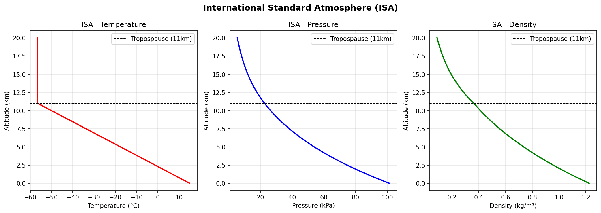

# Project 4 — ISA Atmosphere Model

**Status: Complete**  
**Tool: Python — NumPy, Matplotlib**  
**Author: Manya Tiwari | Aerospace Engineering Year 2 | KIIT University**

## What this project does
Implements the International Standard Atmosphere (ISA) 
model in Python. Computes temperature, pressure, and 
density from sea level to 20km altitude across two 
atmospheric layers — troposphere and stratosphere.

## What is ISA
The International Standard Atmosphere is a mathematical 
model of how the atmosphere behaves under average 
conditions. Every aircraft is designed and certified 
against ISA values. Every aerospace engineer uses it.

## Atmospheric layers modelled

### Troposphere (0 to 11km)
Temperature drops linearly at 6.5°C per 1000m.
From 15°C at sea level to -56.5°C at 11km.

### Stratosphere (11km to 20km)
Temperature constant at -56.5°C (216.65 K).
Pressure drops exponentially with altitude.

## Key equations
Temperature:  T = 288.15 - 6.5 × h        (troposphere)
              T = 216.65                  (stratosphere)
Pressure:     P = P0 × (T/T0)^5.2561      (troposphere)
              P = P11 × exp(-g×Δh / R×T)  (stratosphere)
Density:      ρ = P / (R × T)             (ideal gas law)

## Results

### ISA profile plots


### Standard values table
| Altitude | Temp (°C) | Pressure (kPa) | Density (kg/m³) |
|----------|-----------|----------------|-----------------|
| 0 m | 15.00 | 101.325 | 1.2250 |
| 2000 m | 2.00 | 79.488 | 1.0064 |
| 4000 m | -11.00 | 61.629 | 0.8190 |
| 6000 m | -24.00 | 47.168 | 0.6595 |
| 8000 m | -37.00 | 35.587 | 0.5250 |
| 10000 m | -50.00 | 26.424 | 0.4125 |
| 11000 m | -56.50 | 22.620 | 0.3637 |
| 15000 m | -56.50 | 12.042 | 0.1936 |
| 20000 m | -56.50 | 5.472 | 0.0880 |

## Application — rocket simulation upgrade
This ISA model was integrated into Project 2 
(rocket trajectory simulation) to replace the 
constant sea-level density assumption.

| Version | Peak Altitude |
|---------|--------------|
| Constant density (1.225 kg/m³) | 2958.8 m |
| ISA variable density | 2974.8 m |

Result: +16m higher with ISA — thinner air at 
altitude reduces drag, allowing slightly higher peak.

## How to use
```python
from isa_atmosphere import isa_atmosphere

# Get values at specific altitude
T, P, rho = isa_atmosphere(5000)  # at 5000m
print(f"Density at 5km: {rho[0]:.4f} kg/m³")

# Get full profile
h = np.linspace(0, 20000, 500)
T, P, rho = isa_atmosphere(h)
```

## Skills used
Python · NumPy · Matplotlib · Atmospheric science ·  
ISA standard · Ideal gas law · Exponential decay modelling

## Connection to aerospace
ISA values are used in:
- Aircraft performance calculations
- Engine certification testing  
- Flight envelope design
- Altimeter calibration
- Your future CFD analysis in ANSYS
